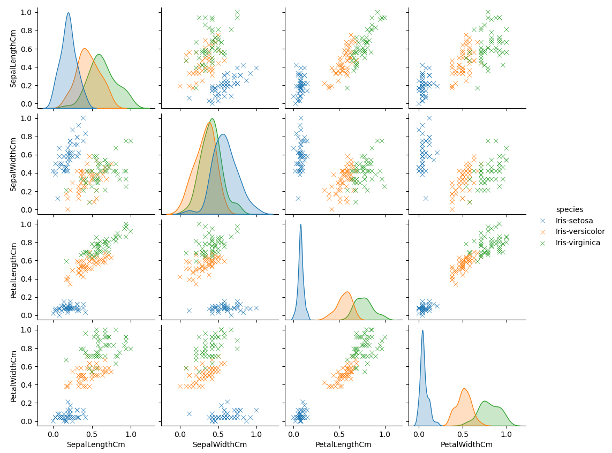
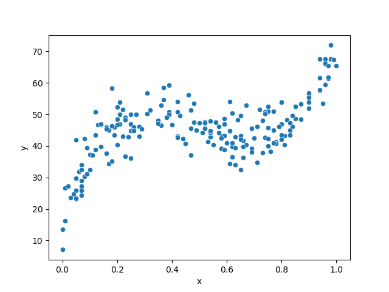

# Instructions

**Run the Models from Run_models.py file**

## Data Visualization

## Iris Dataset

- After inspecting the dataset, it is easy to conclude that we have 150 values, with 4 different features and 50 observation for each feature. 

- From the image bellow, we can observer that the behaviour or results from Iris-Setosa is quite distinct from the other 2 species. 
- Iris-Versicolor and Virginica appear to have similar values. 

## Polynomial Dataset

- We can conclude that we have 200 instance in total
- Both, x and y, have 200 values. So, no missing values. 

- From the Polynomial Scatter Plot we can observe that when x range (0.0-0.2) y values start small but rapidly increases. 
- x value between (0.2-0.8) maintain a regular range of y-values between (30-60)
- When x is 0.8< y-values suffer an increment, reaching the highest y-value of 70.

